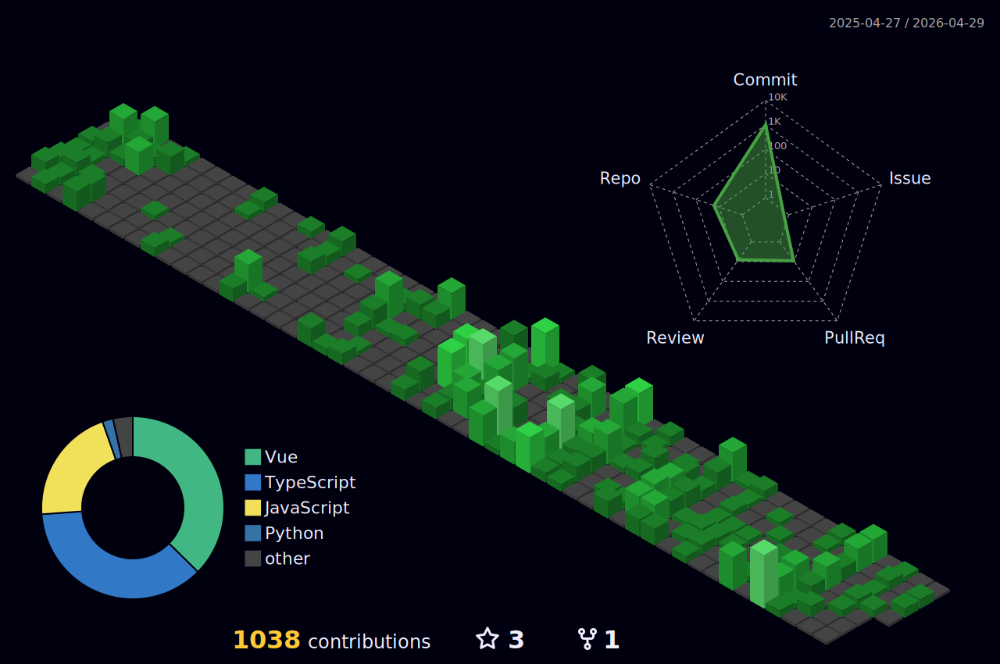

```js
const Roma = {
  frontend: {
    core: ['HTML5', 'CSS3', 'JavaScript', 'TypeScript'],
    frameworks: {
      React: { primary: true, mastery: 80, projects: '>10' },
      NextJS: { mastery: 70, projects: '3' },
      Vue: { mastery: 70, projects: '3' },
      Nuxt3: { mastery: 70, projects: '2' },
    },
    styling: ['Tailwind', 'Bootstrap', 'MUI', 'Stylus'],
    design: ['Figma', 'UI/UX', 'Responsive', 'Animation'],
    tools: {
      packageManagers: ['NPM', 'Yarn', 'PNPM'],
      bundlers: ['Webpack', 'Vite', 'Gulp'],
      linting: ['ESLint', 'Prettier'],
    },
  },
  backend: {
    NodeJS: {
      primary: true,
      frameworks: ['Express', 'NestJS'],
      libs: ['Socket.io', 'multer', 'bcrypt'],
    },
    Python: {
      frameworks: ['FastAPI', 'Flask'],
      tools: ['NumPy', 'Pandas', 'Matplotlib'],
      bots: ['AIOgram v3', 'Telethon'],
    },
    auth: ['JWT', 'Session'],
    orm: ['Prisma'],
  },
  databases: {
    SQL: {
      systems: [
        { name: 'MySQL', primary: true },
        { name: 'PostgreSQL' },
        { name: 'SQLite' },
        { name: 'MariaDB' },
      ],
    },
    NoSQL: {
      systems: [
        { name: 'MongoDB', primary: true },
        { name: 'Redis' },
      ],
    },
    legacy: ['1C:Предприятие'], // это было давно и неправда
  },
  devops: {
    automation: ['GitHub Actions', 'PM2'],
    servers: ['Nginx'],
    api: ['Swagger', 'Postman'],
  },
  tools: {
    os: ['PowerShell', 'Bash'],
    versionControl: ['Git'],
    workflows: ['Nodemon'],
    documentation: ['Markdown', 'Technical Writing'],
  },
  concepts: {
    apiStyles: ['REST'],
    software: ['SOLID', 'OOP', 'DRY', 'KISS'],
  },
  education: [
    {
      university: 'Far Eastern Federal University (FEFU)',
      degree: "Bachelor's Degree",
      major: 'Software Engineering',
      years: '2021-2025',
    },
    {
      university: 'Far Eastern Federal University (FEFU)',
      degree: "additional education",
      major: 'IT Product Manager',
      years: '2024-2025',
    },
  ],
  funFact: 'На 3-м курсе бакалавра за 2 недели сделал 10 курсовых с документацией',
  contact: {
    telegram: '@shevelev_rv',
    email: 'shevelev.rv328@gmail.com',
    site: 'https://srv328.tech',
  },
  sayHi() {
    return "Thanks for visiting! Let's build something awesome together. ☄️";
  },
};

console.log(Roma.sayHi());

```

<div align="center">
  
</div>

<div align="center">
  


</div>

<div align="center" style="margin: 40px 0;">
  
</div>

