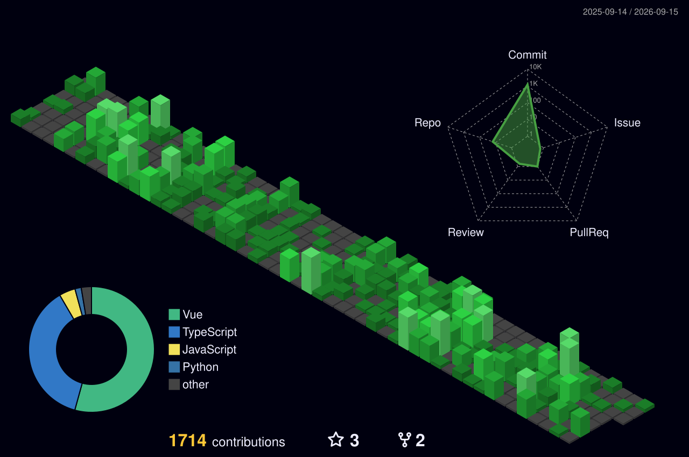

```js
const Roma = {
  frontend: {
    core: ['HTML5', 'CSS3', 'Sass', 'JavaScript', 'TypeScript'],
    frameworks: {
      React: { primary: true, mastery: 80, projects: '>10' },
      NextJS: { mastery: 70, projects: '2+' }, // Post Pioneer, Panda Avto
      Vue: { mastery: 70, projects: '3+' },
      Nuxt: { mastery: 70, projects: '3' }, // Sociolit, Interactive Avant-garde, Prosimetron
    },
    state: ['Redux Toolkit', 'Pinia', 'RTK Query'],
    styling: [
      'Tailwind CSS',
      'Bootstrap',
      'MUI',
      'Vuetify',
      'styled-components',
      'Sass/SCSS',
    ],
    uiMotion: ['Framer Motion', 'GSAP', 'Swiper', 'Lenis'],
    design: ['Figma', 'UI/UX', 'Responsive', 'Animation'],
    libs: ['Axios', 'Zod', 'React Router', 'TipTap', 'Plotly.js'],
    testing: ['Vitest', 'Playwright'],
    tools: {
      packageManagers: ['NPM', 'Yarn', 'PNPM'],
      bundlers: ['Vite', 'Webpack', 'Gulp'],
      linting: ['ESLint', 'Prettier'],
    },
  },
  backend: {
    NodeJS: {
      primary: true,
      frameworks: ['Express', 'NestJS'],
      libs: ['Prisma', 'Mongoose', 'BullMQ', 'multer', 'bcrypt', 'Nodemailer', 'Passport/JWT'],
    },
    Python: {
      frameworks: ['FastAPI', 'Flask'],
      tools: ['NumPy', 'Pandas', 'Matplotlib'],
      bots: ['AIOgram v3', 'Telethon'],
    },
    auth: ['JWT', 'Session', 'Cookies'],
    orm: ['Prisma', 'Mongoose', 'mysql2'],
    media: ['FFmpeg'],
  },
  databases: {
    SQL: {
      systems: [
        { name: 'MySQL', primary: true },
        { name: 'PostgreSQL' },
        { name: 'SQLite' },
      ],
    },
    NoSQL: {
      systems: [
        { name: 'MongoDB', primary: true },
        { name: 'Redis' },
      ],
    },
    legacy: ['1C:Предприятие'], // это было давно и неправда
  },
  devops: {
    containers: ['Docker', 'Docker Compose'],
    automation: ['GitHub Actions', 'PM2'],
    servers: ['Nginx', 'Traefik', 'Linux VPS'],
    monitoring: ['Grafana', 'Loki'],
    api: ['Swagger', 'Postman'],
  },
  tools: {
    os: ['PowerShell', 'Bash'],
    versionControl: ['Git'],
    workflows: ['Nodemon'],
    documentation: ['Markdown', 'Technical Writing'],
  },
  concepts: {
    apiStyles: ['REST'],
    architecture: ['Feature-Sliced Design', 'Microservices'],
    software: ['SOLID', 'OOP', 'DRY', 'KISS'],
  },
  highlights: [
    'Post Pioneer — full-stack SaaS (Next.js, NestJS, BullMQ, Docker, GitHub Actions)',
    'Commercial sites: Vlad Auto, Panda Avto, Kammarket, RIK Real Estate',
    'HSE research UIs: Sociolit, Interactive Avant-garde, Prosimetron',
  ],
  education: [
    {
      university: 'Far Eastern Federal University (FEFU)',
      degree: "Bachelor's Degree",
      major: 'Software Engineering',
      years: '2021-2025',
    },
    {
      university: 'Far Eastern Federal University (FEFU)',
      degree: 'Additional education',
      major: 'IT Product Manager',
      years: '2024-2025',
    },
  ],
  funFact: 'На 3-м курсе бакалавра за 2 недели сделал 10 курсовых с документацией',
  contact: {
    telegram: '@shevelev_rv',
    email: 'shevelev.rv328@gmail.com',
    site: 'https://srv328.ru',
    github: 'https://github.com/srv328',
  },
  sayHi() {
    return "Thanks for visiting! Let's build something awesome together. ☄️";
  },
};

console.log(Roma.sayHi());

```

<div align="center">
  
</div>

<div align="center">
  <a href="https://git.io/streak-stats"></a>
</div>

